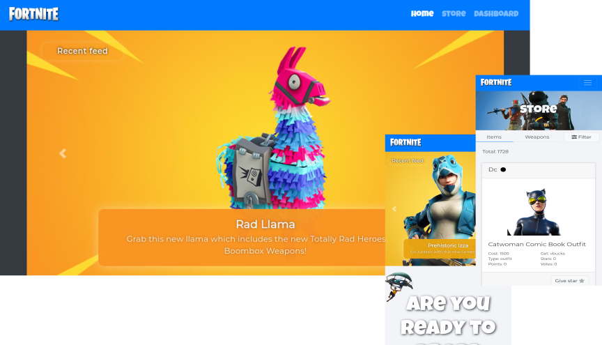

## PROJECT NEWS!!
--> ~~FortniteAPI services are currently unstable, I'm looking forward for a new api provider to fix the issue.~~
--> API abandoned by mantainer looking for a stable api.

#### Live preview

[Codesandbox Testing](https://codesandbox.io/s/github/adnfx2/fornite-api-react)

---

# -- FortniteStarred --

### About

FortniteStarred It's a on-going project meant to facilitate informantion related to fortnite in-game items, weapons & more. All the data is provided by [<forniteapi.com>](https://fortniteapi.com).

### Run this project

This project was bootstraped with "CreateReactApp".

You can simple run:

- `npm install`

- `npm start`

(or yarn start if you prefer it).

### Features

Currently the project have three main sections:

1. **Landing Page** (contains a brief introduction about fortnite and in-game news).
2. **Store** (Here you can navigate, explorer and give stars to a wide variety of in-game weapons & items).
3. **Emptyboard** (Postponed..., A simple message notifying that there's nothing on that page yet)

### Why to create FortniteStarred?

I was looking for a clean and simple way to look up fornite items without too much hassle. Moreover, I wanted to test a new styling library called react-jss (especifically it's latest alpha version) which btw it's very powerfull with it's new react hook.

##### Relevant tech stack used in this project

- HTML/CSS/JS/REACT/REACT-JSS/REDUX

### Updates

-[x] **Landing page** -- completed.

-[x] **Store** -- completed.

-[x] **Emptyboard** -- completed

### Wishlist

-Image optimization (Like medium does).

-Firebase integration to allow user registration and a small cloud storage.

-Page animation transition.

All of those things among others were out of the scope of this project.

---

If you have any suggestions/ideas/feedback let me know here <fx.adrian@gmail.com>.

> No copyright infringement intended, this project was created only for educational purposes & for the ease of sharing fortnite related content.
